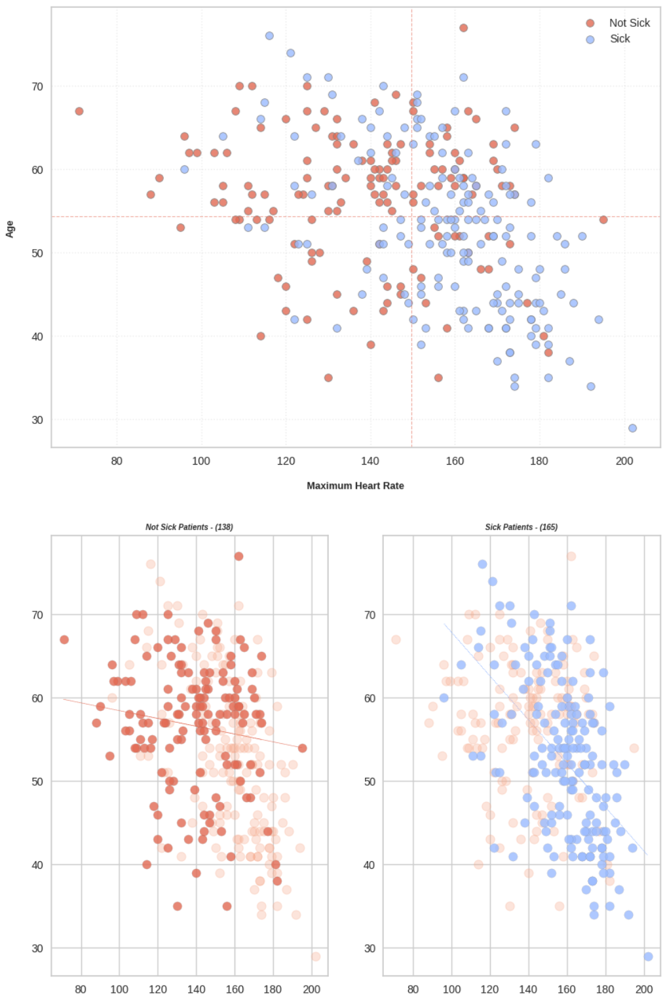

# Health AI
## Example of Health AI project

<!--
*** Written by Martin Karlsson
*** www.martinkarlsson.io
-->

[![LinkedIn][linkedin-shield]][linkedin-url]

<!-- ABOUT THE PROJECT -->
## About The Project

 
Intention with this project is to provide a boilerplate for creating a project with Data Science notebooks for development of models that can predict and forecast various health related use-cases. The project is based on a Jupyter Notebook environment and is intended to be run on AWS SageMaker.
The models will be accessed by a Generative AI model hosted in AWS Bedrock, invoked by a Lambda and triggered by API Gateway.
 

#### AWS High Level Diagram

#### Data Science
Jupyter notebook examples to be used for development of models. The notebooks are based on Python and uses libraries such as Pandas, Numpy, Scikit-learn, Matplotlib and Seaborn. They explore some health related datasets and provide examples of how to preprocess, train and evaluate models along with data exploration and visualization.

<!-- CONTACT -->

## Contact

### Martin Karlsson

LinkedIn : [martin-karlsson][linkedin-url] \
Twitter : [@HelloKarlsson](https://twitter.com/HelloKarlsson) \
Email : hello@martinkarlsson.io \
Webpage : [www.martinkarlsson.io](https://www.martinkarlsson.io)

Project Link: [github.com/martinkarlssonio/health-ah](https://github.com/martinkarlssonio/health-ai)

<!-- MARKDOWN LINKS & IMAGES -->
[linkedin-shield]: https://img.shields.io/badge/-LinkedIn-black.svg?style=for-the-badge&logo=linkedin&colorB=555
[linkedin-url]: https://linkedin.com/in/martin-karlsson